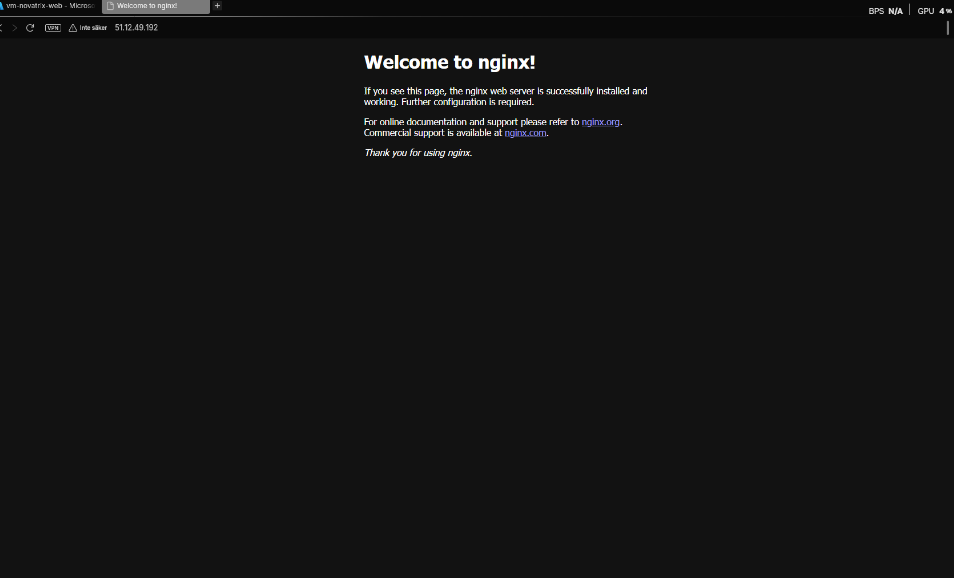
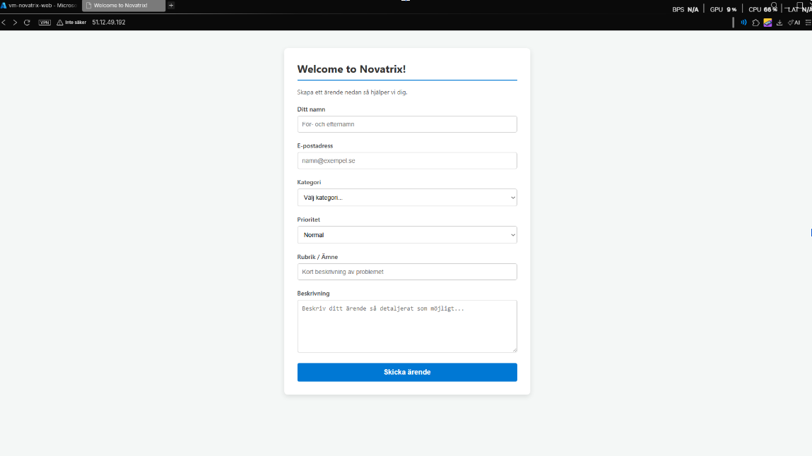

# Azure - Uppgift 1 (V34)
**Compute och kom igång**
#

**Namn:** Simon Fatty

**Repo:** https://github.com/02simfat/azure-MOV25

**Datum** 2026-08-30

# Syfte
Novatrix AB vill flytta sin kundtjänst till molnet. Den här veckan sätts en virtull server upp i azure och en enkel webbsida med ett ärenderformulär.

## Implementering - Resursgrupp/VM
Skapde resursgruppen och en virtull maskin via Azure portal.

- **Resursgrupp:** `rg-novatrix-v34`, Region `Sweden Central`
- **VM Namn:** `vm-novatrix-web`
- **Image:** `Ubunto Server 24.04 LTS -x64 Gen2`
- **Storlek:** `B2ats_v2`, Virtuella processorer (2), kostnad per månad 7,10 US$
- **Nätverk:** Publikt IP `51.12.49.192`
- **SSH-Nyckel**  `vm-novatrix-web-key.pem`

## Anslutning med SSH 
När jag försökte sätta SSH nyckln så endast min användare kan läsa den så fick jag fel `Bad premission`, Då fick jag gå in på egenskaper i nycklen och ta bort behörigheter. 

```powershell
icacls .\vm-novatrix-web-key.pem /reset
icacls .\vm-novatrix-web-key.pem /inheritance:r
icacls .\vm-novatrix-web-key.pem /grant:r "$($env:USERNAME):R"
icacls .\vm-novatrix-web-key.pem
```

Anslutning till server:

```powershell
ssh -i .\vm-novatrix-web-key.pem azureuser-web@51.12.49.192
```

### installation av Nginx
Vad jag gjorde först va att uppdaterde paket och installerade webbservern Nginx.

```bash
# uppdatera paket 

sudo apt update

# uppgradera befintliga paket (fär att säkersälla så allt är på plats)

sudo apt upgrade -y 

# intallera Nginx 

sudo apt insall nginx -y 

# säkerställa att Nginx startar automatiskt när omstart av server 

sudo systemctl enable nginx

# Kontrollera statusen på Nginx 

sudo systemctl status nginx 

```
För att Verifiera genom att surfa till `http://51.12.49.192` i en webläsare. Men det gick inte då fick jag gå in i Nätverksinställningar i azure portalen för att öppna upp port 80 för att nå välkomsssidan.



## Ärendeformulär html design

Bledra till `cd /var/www/html/` för att se att `index.nginx-debian.html` finns och bygga upp mer på `index.nginx-debian.html`. 

```
 
<!DOCTYPE html>
<html lang="sv">
<head>
    <meta charset="UTF-8">
    <meta name="viewport" content="width=device-width, initial-scale=1.0">
    <title>Welcome to Novatrix!</title>
    <style>
        body {
            font-family: 'Segoe UI', Tahoma, Geneva, Verdana, sans-serif;
            background-color: #f4f7f6;
            display: flex;
            justify-content: center;
            align-items: center;
            padding: 40px 20px;
            margin: 0;
        }

        .ticket-card {
            background: #ffffff;
            padding: 30px;
            border-radius: 8px;
            box-shadow: 0 4px 12px rgba(0, 0, 0, 0.1);
            width: 100%;
            max-width: 500px;
        }

        h1 {
            margin-top: 0;
            color: #333333;
            font-size: 24px;
            border-bottom: 2px solid #0078d4;
            padding-bottom: 10px;
        }

        .form-group {
            margin-bottom: 20px;
        }

        label {
            display: block;
            margin-bottom: 6px;
            font-weight: 600;
            color: #444444;
            font-size: 14px;
        }

        input[type="text"],
        input[type="email"],
        select,
        textarea {
            width: 100%;
            padding: 10px;
            border: 1px solid #cccccc;
            border-radius: 4px;
            box-sizing: border-box;
            font-size: 14px;
            transition: border-color 0.2s;
        }

        input:focus,
        select:focus,
        textarea:focus {
            outline: none;
            border-color: #0078d4;
        }

        textarea {
            resize: vertical;
            height: 120px;
        }

        .btn-submit {
            background-color: #0078d4;
            color: white;
            border: none;
            padding: 12px 20px;
            border-radius: 4px;
            cursor: pointer;
            font-size: 16px;
            font-weight: bold;
            width: 100%;
            transition: background-color 0.2s;
        }

        .btn-submit:hover {
            background-color: #005a9e;
        }
    </style>
</head>
<body>

    <div class="ticket-card">
        <h1>Welcome to Novatrix!</h1>
        <p style="color: #666; font-size: 14px; margin-bottom: 20px;">Skapa ett ärende nedan så hjälper vi dig.</p>

        <form action="#" method="POST">
            
            <div class="form-group">
                <label for="name">Ditt namn</label>
                <input type="text" id="name" name="name" placeholder="För- och efternamn" required>
            </div>

            <div class="form-group">
                <label for="email">E-postadress</label>
                <input type="email" id="email" name="email" placeholder="namn@exempel.se" required>
            </div>

            <div class="form-group">
                <label for="category">Kategori</label>
                <select id="category" name="category" required>
                    <option value="" disabled selected>Välj kategori...</option>
                    <option value="teknisk">Teknisk support</option>
                    <option value="faktura">Faktura & Betalning</option>
                    <option value="konto">Konto & Inloggning</option>
                    <option value="ovrigt">Övrigt</option>
                </select>
            </div>

            <div class="form-group">
                <label for="priority">Prioritet</label>
                <select id="priority" name="priority">
                    <option value="lag">Låg</option>
                    <option value="normal" selected>Normal</option>
                    <option value="hog">Hög</option>
                </select>
            </div>

            <div class="form-group">
                <label for="subject">Rubrik / Ämne</label>
                <input type="text" id="subject" name="subject" placeholder="Kort beskrivning av problemet" required>
            </div>

            <div class="form-group">
                <label for="message">Beskrivning</label>
                <textarea id="message" name="message" placeholder="Beskriv ditt ärende så detaljerat som möjligt..." required></textarea>
            </div>

            <button type="submit" class="btn-submit">Skicka ärende</button>

        </form>
    </div>

</body>
</html>

```
Jag skappade den med hjälp av ai, jag gick in på först på https://webdesignskolan.se men hittade ingen snygg formulär, 

## Färdiga äredens formulär bild 

---

### Så här pushar jag upp det till Github:

1. Öppna Terminalen i VS code (`Ctrl + Ö`)
2. gå till mappen för Vecka 34 `cd C:\Azure\azure-MOV25\V34\`
3. kör dessa tre kommandon: 

```Powershell
git add.
git commit -M "klar med inlämning V34"
Git push 

