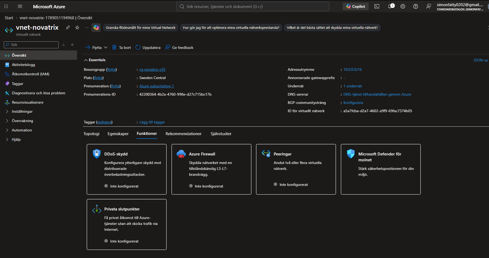
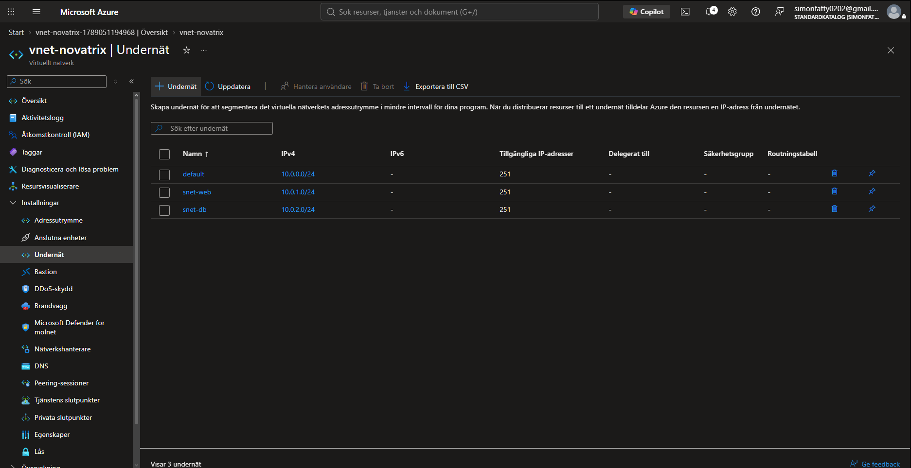
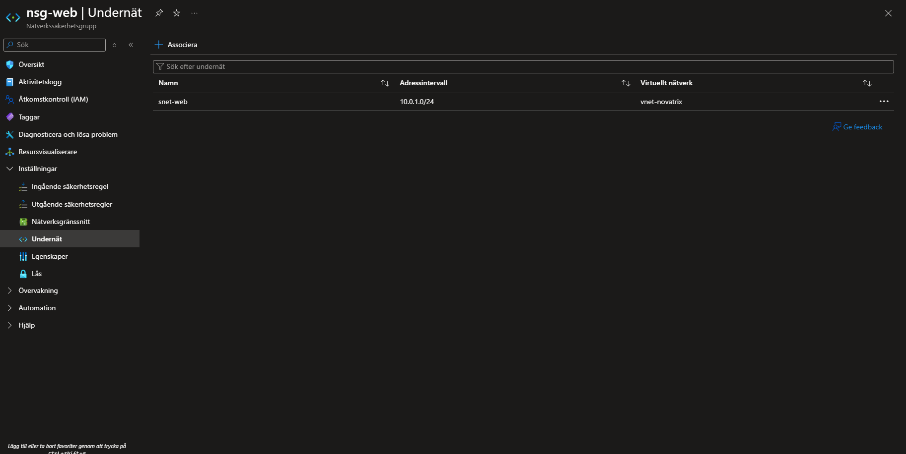
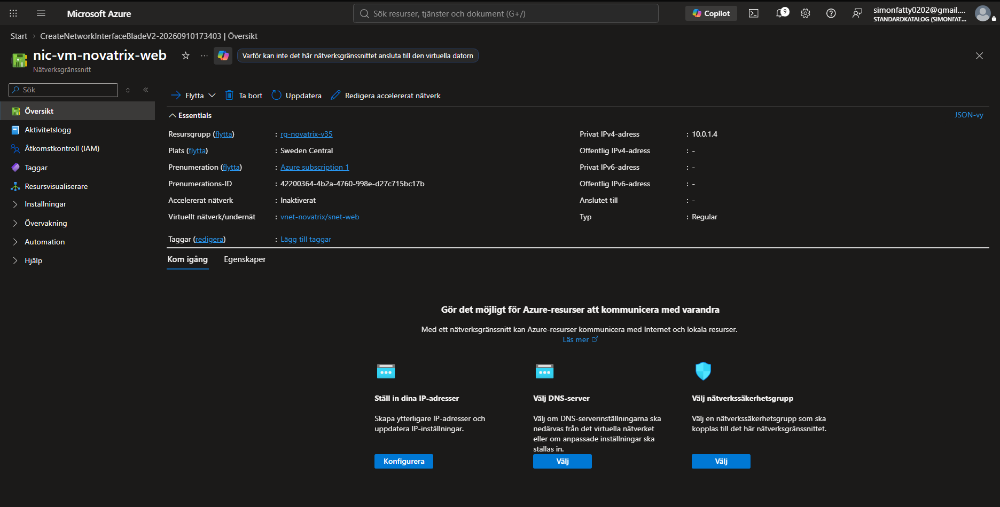
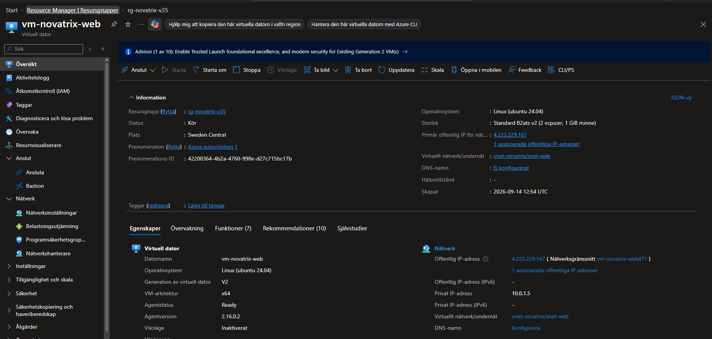
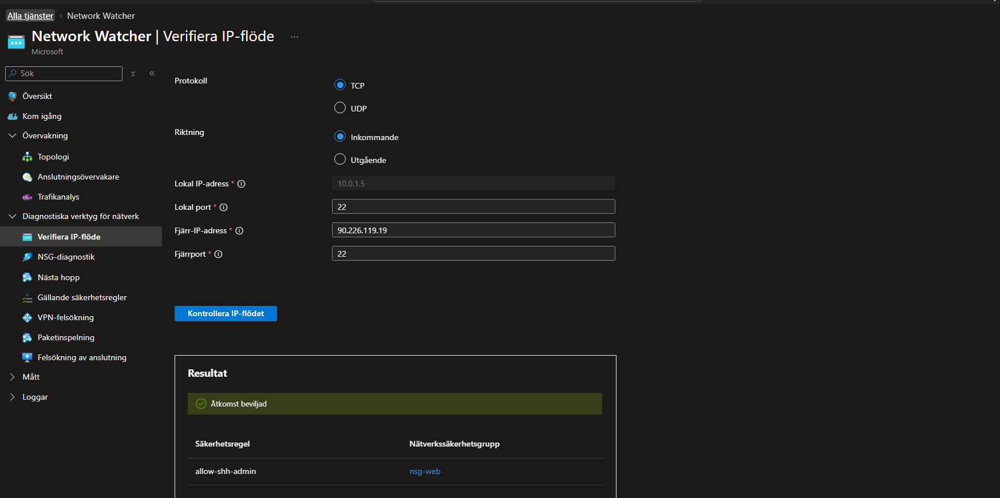
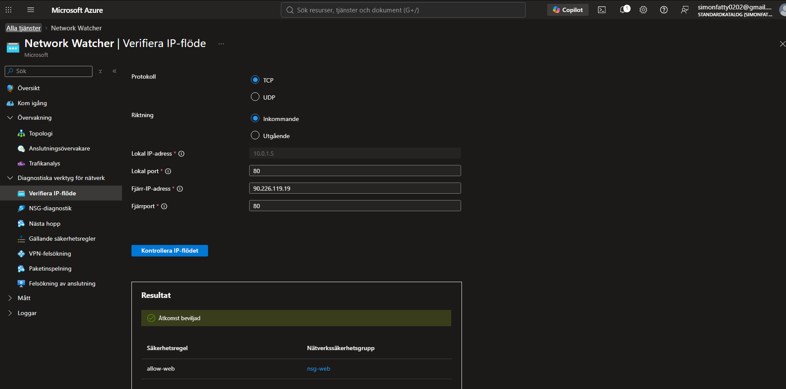

# Azure - Uppgift 3 - (V36)
**Nätverk och säkerhet**
#

**Namn:** Simon Fatty

**Repo:** https://github.com/02simfat/azure-MOV25

**Datum** 2026-08-09

---

## Överskikt och Syfte 

Syftet med denna uppgift är att bygga ett säkert nätverkslager runt Novatrix Kundtjänst, Lösningen applicerar genom att seperera resurser i ett publikt och ett privat subnät, samt tillämpa *least privilege* på nätverksnivå med hjälp av en Network Security Group (NSG).

---

## Nätverksarkitektur opch Design 

Lösningen är uppbyggd inom samma resursgrupp som tidgare veckor (`rg-novatrix-v35` / `rg-novatrix`).

* **Virtuellt nätverk (VNet):** `vnet-novatrix`
  * **Adressrymd:** `10.0.0.0/16`
* **Subnät:**
  * `snet-web` (`10.0.1.0/24`) – Publikt subnät avsett för webbservern och ärendeformuläret.
  * `snet-db` (`10.0.2.0/24`) – Privat subnät förberett för framtida lagring och backend-komponenter.

  --- 

## Konfiguration av Network Securty Group (NSG)

För att säkra trafiken skapades nätverkksäkerhetsgruppen **nsg-web** och associerades direkt till subnätet **snet-web**.

### Inkommande Säketrhetsregler (inbound Rules)

| Prioritet | Namn | Källa (Source) | Tjänst / Port | Protokoll | Åtgärd (Action) | Syfte / Motivering |
| :--- | :--- | :--- | :--- | :--- | :--- | :--- |
| **100** | `allow-web` | Service Tag: `Internet` | Custom (80, 443) | TCP | Allow | Tillåter publik webbtrafik till kundtjänstformuläret. |
| **200** | `allow-ssh-admin` | IP Address: `[Min publika IP]` | SSH (22) | TCP | Allow | Begränsar administrativ SSH-åtkomst enbart till min egen IP. |

Säkerhetsmotivering (Least Privilege). **Port 22** hålls strikt begränsad till en specifik IP-adress istället för att vara öppen mot hela internet. Övrig trafik stoppas auytomatiskt av Azure NSG:s standaregler (default Deny).

---

## Genomförande och Omplacering av Vrituell maskin 

Eftersom en virtuell maskin nätverskort (NIC) inte kan flyttas rakt av till ett nätverk efter att maskinen har skapats, gjode jag följande steg för att flutta webbservern säket:

1. **Snapshot & Backup:** En snapshot tog på den befintliga virtuella maskinen (`vm-novatrix-web`).
2. **Borttagning av VM:** Den ursprungliga VM:en raderades medan OS-disken behölls intakt.
3. **Nätverksgränssnitt (NIC):** Ett nytt nätverkskort skapades:
   * **Namn:** `nic-vm-novatrix-web`
   * **Resursgrupp:** `rg-novatrix-v35`
   * **VNet / Subnet:** `vnet-novatrix` / `snet-web` (`10.0.1.0/24`)
4. **Återskapande från disk:** VM:en återskapades utifrån den sparade disken och kopplades till det nya nätverkskortet i `snet-web`. Detta säkerställde att webbapplikationen låg kvar orörd på det nya subnätet.

---

## Verifering och Testning av Trafikflöden 

För att bbekräfta att nätverkreglerna fungerarde korrekt användes **IP Flow Verify** (via Network Watcher) samt manuelt sök up hemsidan.

* **HTTP/HTTPS (Port 80/443):** Verifierat med utfall `Allow` från valfria käll-IP:er. Webbplatsen laddades korrekt.
* **SSH (Port 22) från min IP:** Verifierat med utfall `Allow`. Inloggning lyckades.
* **SSH (Port 22) från övriga IP-adresser:** Verifierat med utfall `Deny` via IP Flow Verify simulation. Åtkomst blockeras av säkerhetsreglerna.

