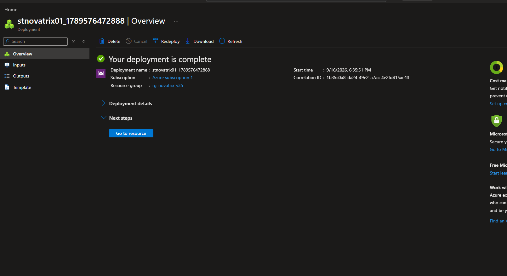
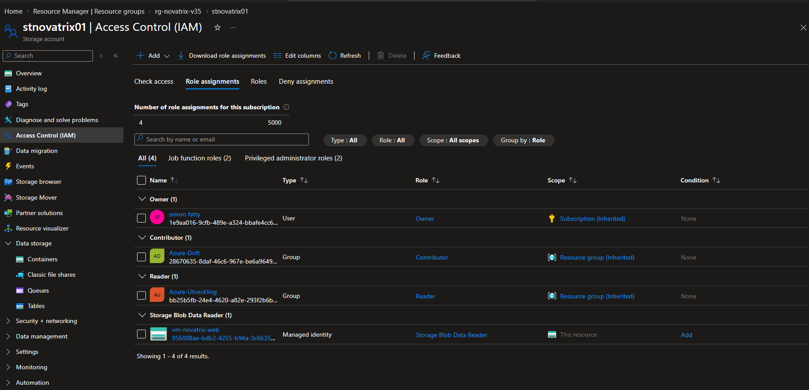
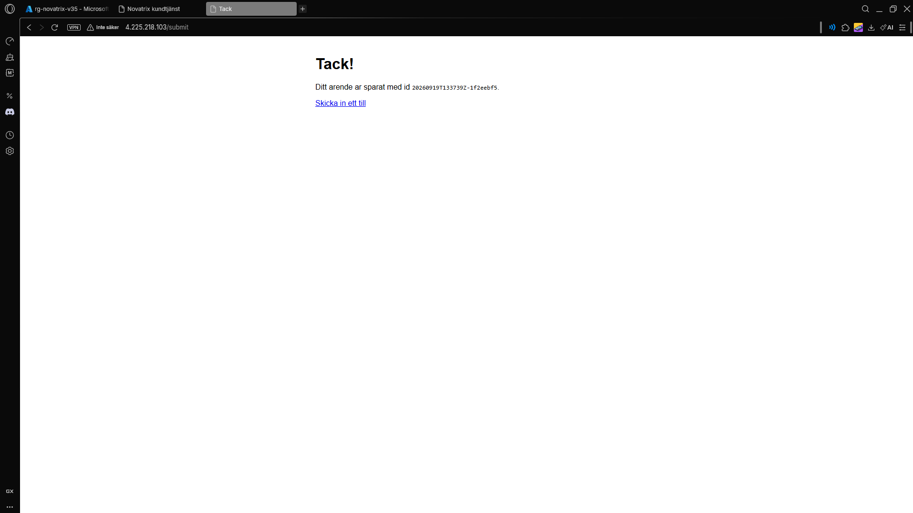
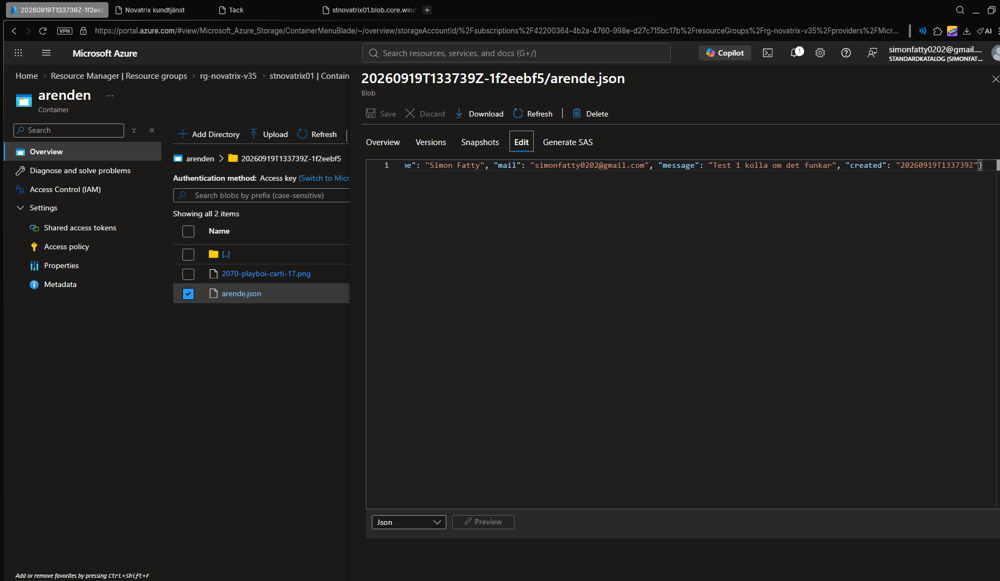

# Azure - Uppgift 4 - (V37)
**Storage**
#

**Namn:** Simon Fatty

**Repo:** https://github.com/02simfat/azure-MOV25

**Datum** 2026-08-18

---

## Överskit
Syftet med denna uppgift var att göra ärendeformuläret fullt funktionellt genom att koppla det till en molnbaserad lagringstjänst i Azure (Blob Storage). Inskickade ärenden (JSON-data) och bifogade filer sparas nu automatiskt och säkert i en container utan användning av hårdkodade nycklar eller anslutningssträngar. 

--- 

## 1. Skapa Storage Account och Container 

Ett Storage Account skapades i Azure Portalen under resursgruppen.

* **Resursgrupp:** `rg-novatrix-v35`
* **Storage Account Name:** `stnovatrix01`
* **Tjänst:** Azure Blob Storage
* **Redundans:** *Locally-redundant storage (LRS)*

Motivering:* LRS valdes för att minimera kostnaderna under utvecklings, samt ger ett grundläggande men starkt dataskydd inom ett datacenter. 

Inuti Storage account skapades en container: 

* **Container:** `arenden`
* **Åtkomstnivå:** Privat (Private / No anonymous access) för att förhindra obehörig direktåtkomst från internet.

---

## 2. Säkra åtkkomsten (Managed Ideinity och Least Privilege)

För att följa princip om *least privilege* och undvika att komprometera nycklar i koden användes inte Storage Account-nycklar:

1. **System-Assigned Managed Identity:** Aktiverades på den virtuella maskinen (`vm-novatrix-web`).
2. **Rollbaserad behörighet (RBAC):** Via IAM tilldelades maskinens identitet rollen **`Storage Blob Data Contributor`** begränsat direkt till resursgruppen/containern.
3. **SAS-token:** Genererades och verifierades för manuell/tillfällig utläsning av enstaka filer vid behov utan att dela ut fullständiga administratörsrättigheter.

--- 

## 3. Koppling till formuläret och Verifiering 

Formuläret testades via webbgränssnittet. när användaren fyller i formuläret och bifogar en bild skickas datan till backenden, som via maskinens Managed idenity autensering sig mot Azure Blob Storage.

### Skapat testärende:
* **Skapat ID:** `20260919T133739Z-1f2eebf5`
* **Namn:** Simon Fatty
* **E-post:** simonfatty0202@gmail.com
* **Meddelande:** "Test 1 kolla om det funkar"


### Exempel på genererad JSON-fil i Blob Storage:
```json
{
  "id": "20260919T133739Z-1f2eebf5",
  "name": "Simon Fatty",
  "mail": "simonfatty0202@gmail.com",
  "message": "Test 1 kolla om det funkar",
  "created": "20260919T133739Z"
}
