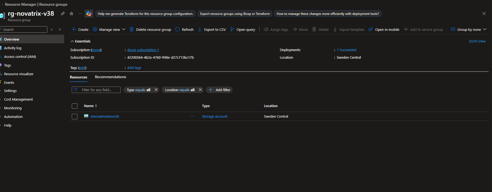
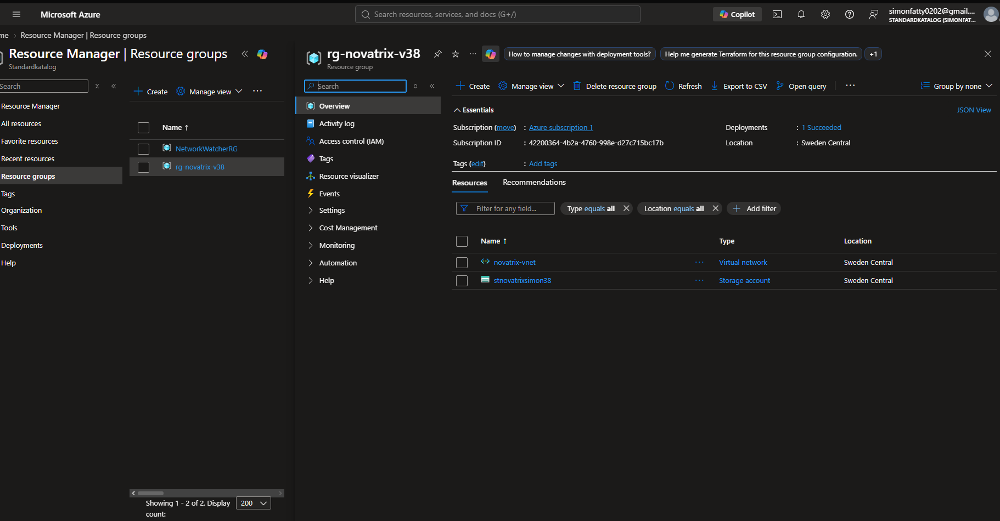
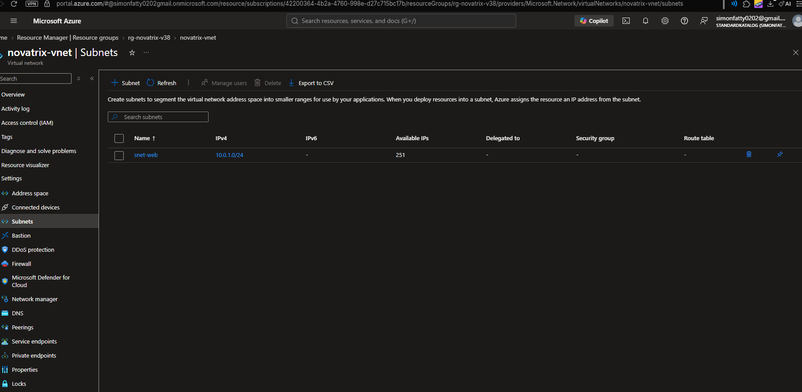
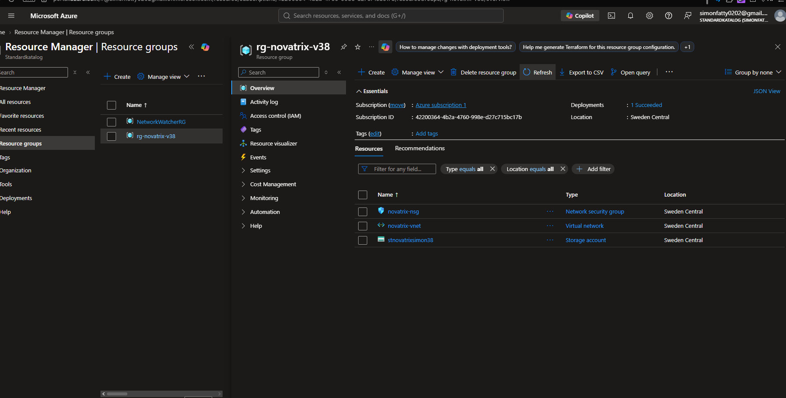
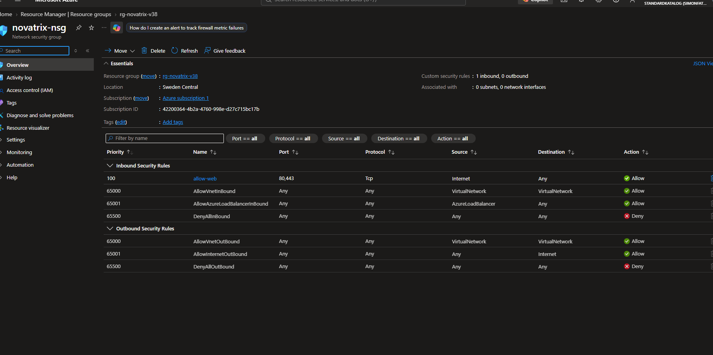
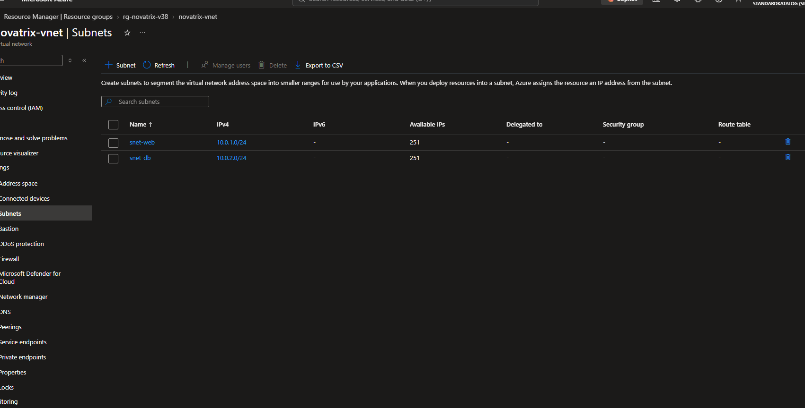
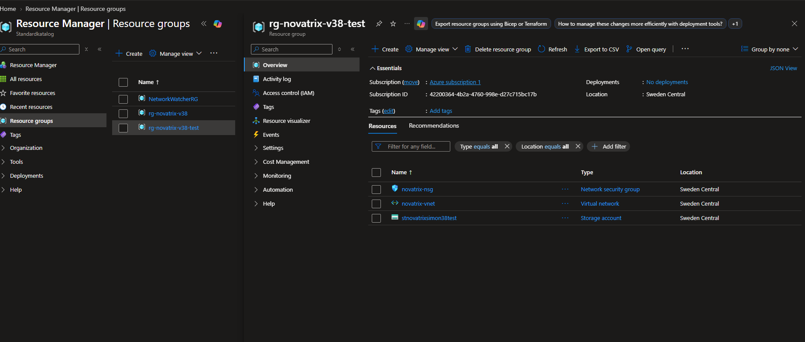

# Azure -Uppgift 5 - (v38)
**IaC med ARM-teamplates**

#
**Namn:** Simon Fatty

**Repo:** https://github.com/02simfat/azure-MOV25

**Datum** 2026-09-21

---

## Överskit 

Den här veckan har jag skapat en del av Novatix miljö som kod med ARM-templates , i stället för att klicka i portalen. Teamplaten skapar tre resurser, Ett storage Account , ett virtuellt närverk (Vnet) med två subnät och en nätverkssäkerhetgrupp (NSG).

--- 

## Filer i repot 

```text
V38/
├── README.md                          (den här filen)
├── bilder/                            (skärmbilder från portalen)
└── v38-startpaket/
    ├── miljo-skelett.json             min template (storage, VNet, NSG)
    ├── azuredeploy.parameters.json    mina parametervärden
    ├── azuredeploy-enkel.json         startpaket, första testet
    ├── azuredeploy-parametriserad.json  - Andreas s (läger man till ett till S?)
    ├── storage.bicep                    - Andreas s (dyslexi fråga? )
    └── README.md                      startpaketets egen README
```

---

## 1. Första Deployen

Jag började med att ladda ner starkpaketets mall. Sedan körde jag tre kommandon i ordning:

- `validate` kontrollerar att filen är rätt skriven.
- `what-if` visar vad som skulle hända, utan att göra det.
- `create` bygger på riktigt.

```powershell
az group create --name rg-novatrix-v38 --location swedencentral
az deployment group validate -g rg-novatrix-v38 --template-file azuredeploy-enkel.json --parameters storageName=stnovatrixsimon38
az deployment group what-if -g rg-novatrix-v38 --template-file azuredeploy-enkel.json --parameters storageName=stnovatrixsimon38
az deployment group create -g rg-novatrix-v38 --template-file azuredeploy-enkel.json --parameters storageName=stnovatrixsimon38
az resource list -g rg-novatrix-v38 -o table
```

storage-kontots namn måste vara golbalt unikt i hela Azure, med brar smp bokstaver och siffror. `stnovatrixsimon38`.

Utskriften visade `"provisioningState": "Succeeded"` och den här tabellen:

```text
Name               ResourceGroup    Location       Type                               Status
-----------------  ---------------  -------------  ---------------------------------  ---------
stnovatrixsimon38  rg-novatrix-v38  swedencentral  Microsoft.Storage/storageAccounts  Succeeded
```


--- 

## 2. Min teamplate: miljo-sklett.json 

Därefter byggde på teamplaten i `miljo-skelett.json` en resurs i taget. jag deployade efter varje tillägg.

**Parametrar** (det som varierar):

| Parameter | Typ | Standardvärde | Varför en parameter |
| :--- | :--- | :--- | :--- |
| `namePrefix` | string | `novatrix` | Ger alla resurser samma prefix, så namnen hänger ihop |
| `storageName` | string | (inget) | Måste vara globalt unikt, alltså olika för varje deploy |
| `location` | string | `swedencentral` | Regionen kan behöva ändras |
 
**Resurser:**

| Resurs | Typ | Namn | Motivering |
| :--- | :--- | :--- | :--- |
| Storage account | `Microsoft.Storage/storageAccounts` | från `storageName` | `Standard_LRS`, den billigaste redundansen, räcker för labben |
| Virtuellt nätverk | `Microsoft.Network/virtualNetworks` | `novatrix-vnet` | Adressrymd `10.0.0.0/16` med subnäten `snet-web` (`10.0.1.0/24`) och `snet-db` (`10.0.2.0/24`) |
| Nätverkssäkerhetsgrupp | `Microsoft.Network/networkSecurityGroups` | `novatrix-nsg` | Regeln `allow-web` släpper in bara port 80 och 443 (least privilege) |

```json
{
  "$schema": "https://schema.management.azure.com/schemas/2019-04-01/deploymentTemplate.json#",
  "contentVersion": "1.0.0.0",
  "parameters": {
    "namePrefix": {
      "type": "string",
      "defaultValue": "novatrix",
      "metadata": { "description": "Prefix for alla resursnamn, sa att allt hanger ihop." }
    },
    "storageName": {
      "type": "string",
      "metadata": { "description": "Globalt unikt namn, sma bokstaver och siffror." }
    },
    "location": {
      "type": "string",
      "defaultValue": "swedencentral",
      "metadata": { "description": "Region for resurserna." }
    }
  },
  "variables": {
  },
  "resources": [
    {
      "type": "Microsoft.Storage/storageAccounts",
      "apiVersion": "2023-01-01",
      "name": "[parameters('storageName')]",
      "location": "[parameters('location')]",
      "sku": { "name": "Standard_LRS" },
      "kind": "StorageV2"
    },
    {
      "type": "Microsoft.Network/virtualNetworks",
      "apiVersion": "2023-09-01",
      "name": "[concat(parameters('namePrefix'), '-vnet')]",
      "location": "[parameters('location')]",
      "properties": {
        "addressSpace": {
          "addressPrefixes": [ "10.0.0.0/16" ]
        },
        "subnets": [
          {
            "name": "snet-web",
            "properties": {
              "addressPrefix": "10.0.1.0/24"
            }
          },
          {
            "name": "snet-db",
            "properties": {
              "addressPrefix": "10.0.2.0/24"
            }
          }
        ]
      }
    },
    {
      "type": "Microsoft.Network/networkSecurityGroups",
      "apiVersion": "2023-09-01",
      "name": "[concat(parameters('namePrefix'), '-nsg')]",
      "location": "[parameters('location')]",
      "properties": {
        "securityRules": [
          {
            "name": "allow-web",
            "properties": {
              "priority": 100,
              "direction": "Inbound",
              "access": "Allow",
              "protocol": "Tcp",
              "sourceAddressPrefix": "Internet",
              "sourcePortRange": "*",
              "destinationAddressPrefix": "*",
              "destinationPortRanges": [ "80", "443" ]
            }
          }
        ]
      }
    }
  ],
  "outputs": {
  }
}
```

---

## 3. Parameterfill

Värdena ligger i en egen fill `azuredeploy.parameters.json`.

```json
{
  "$schema": "https://schema.management.azure.com/schemas/2019-04-01/deploymentParameters.json#",
  "contentVersion": "1.0.0.0",
  "parameters": {
    "namePrefix": { "value": "novatrix" },
    "storageName": { "value": "stnovatrixsimon38" },
    "location": { "value": "swedencentral" }
  }
}
```
I powershell glöm inte `@` måste vara inom citattecken, kör också komandon 1 i taget för minst strul

```powershell
az deployment group validate -g rg-novatrix-v38 --template-file miljo-skelett.json --parameters '@azuredeploy.parameters.json'
az deployment group what-if -g rg-novatrix-v38 --template-file miljo-skelett.json --parameters '@azuredeploy.parameters.json'
az deployment group create -g rg-novatrix-v38 --template-file miljo-skelett.json --parameters '@azuredeploy.parameters.json'
```

What - if `what-if`

```text
Resource and property changes are indicated with this symbol:
  = Nochange
 
Scope: /subscriptions/<prenumerations-id>/resourceGroups/rg-novatrix-v38
 
  = Microsoft.Network/networkSecurityGroups/novatrix-nsg [2023-09-01]
  = Microsoft.Network/virtualNetworks/novatrix-vnet [2023-09-01]
  = Microsoft.Storage/storageAccounts/stnovatrixsimon38 [2023-01-01]
 
Resource changes: 3 no change.
```

--- 

## 4.  Verifiering i portalen

Jag kollade i portalen att resurserna blev som templaten. Efter att VNet lades till fanns storage och VNet i resursgruppen:
 

 
VNet hade subnätet `snet-web` med `10.0.1.0/24`:


 
Efter att NSG:n lades till fanns alla tre resurserna:
 

 
NSG:n har regeln `allow-web` med port 80 och 443. Raderna med prioritet 65000 och högre är Azures standardregler. `DenyAllInBound` stoppar all annan inkommande trafik.
 

 
---

## 5. Versionshantering
 
Jag gjorde en ändring i templaten: jag lade till det privata subnätet `snet-db` (`10.0.2.0/24`) som förberedelse för backend och lagring, samma design som i V36. Sedan körde jag `what-if`, deployade om och committade.
 
```powershell
az deployment group what-if -g rg-novatrix-v38 --template-file miljo-skelett.json --parameters '@azuredeploy.parameters.json'
az deployment group create -g rg-novatrix-v38 --template-file miljo-skelett.json --parameters '@azuredeploy.parameters.json'
git add miljo-skelett.json
git commit -m "Lägger till privat subnät snet-db för framtida backend och lagring"
git push
```
 
Portalen visar nu båda subnäten:
 

 
## Versionshantering syfte

- **Spårbarhet:** varje commit visar vad som ändrades.
- **Ångra:** blir något fel kan man gå tillbaka till en tidigare version av templaten.
- **Samarbete:** flera personer kan föreslå ändringar via repot, och ändringarna syns tydligt.

---

## 6. Återskapa miljön från repot
 
Så här bygger man upp miljön i en tom resursgrupp, utan några klick i portalen.
 
```powershell
git clone https://github.com/02simfat/azure-MOV25.git
cd azure-MOV25\V38\v38-startpaket
az login
az group create --name rg-novatrix-v38-test --location swedencentral
az deployment group what-if -g rg-novatrix-v38-test --template-file miljo-skelett.json --parameters '@azuredeploy.parameters.json' storageName=stnovatrixDITTNAMN01
az deployment group create -g rg-novatrix-v38-test --template-file miljo-skelett.json --parameters '@azuredeploy.parameters.json' storageName=stnovatrixDITTNAMN01
az resource list -g rg-novatrix-v38-test -o table
```
 
Storage-namnet är globalt unikt, så det måste bytas. Därför skriver kommandot över `storageName` från parameterfilen. Det är ett exempel på varför det som varierar är en parameter.
 
Jag klonade repot från GitHub till en ny mapp (`test-klon`) och deployade till en tom resursgrupp med namnet `stnovatrixsimon38test`. Resultat:
 
```text
Name                   ResourceGroup         Location       Type                                     Status
---------------------  --------------------  -------------  ---------------------------------------  ---------
novatrix-nsg           rg-novatrix-v38-test  swedencentral  Microsoft.Network/networkSecurityGroups  Succeeded
stnovatrixsimon38test  rg-novatrix-v38-test  swedencentral  Microsoft.Storage/storageAccounts        Succeeded
novatrix-vnet          rg-novatrix-v38-test  swedencentral  Microsoft.Network/virtualNetworks        Succeeded
```
 

 


