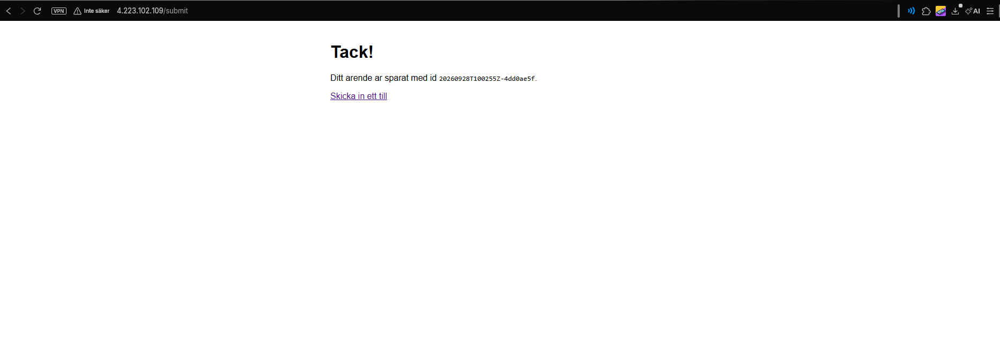
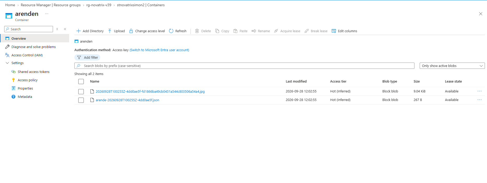
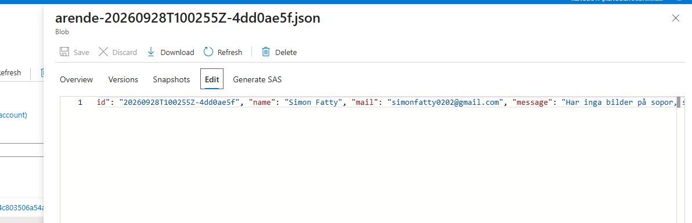
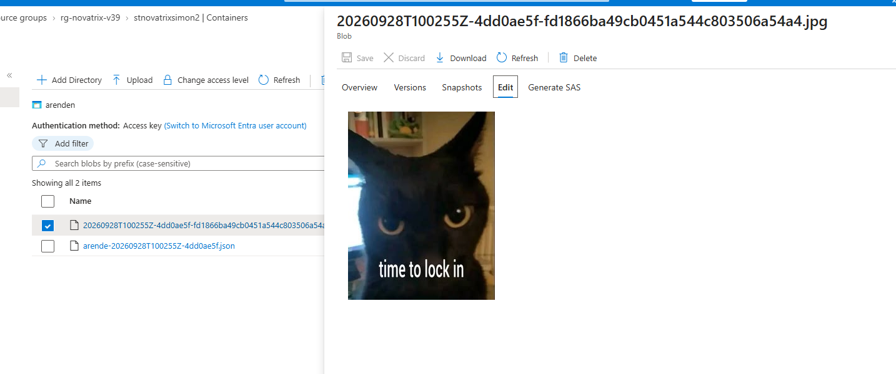
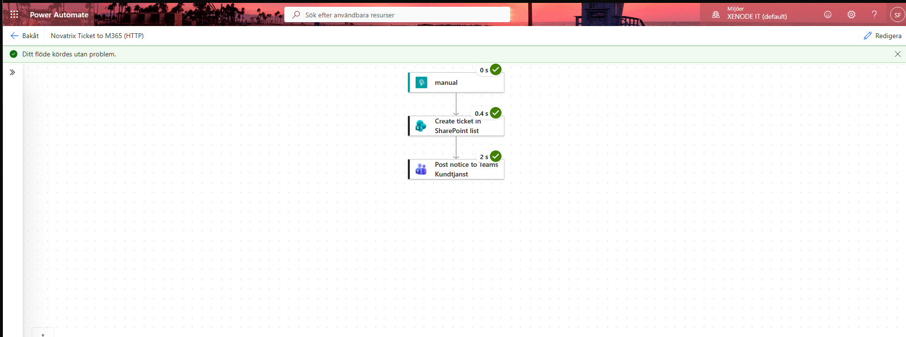
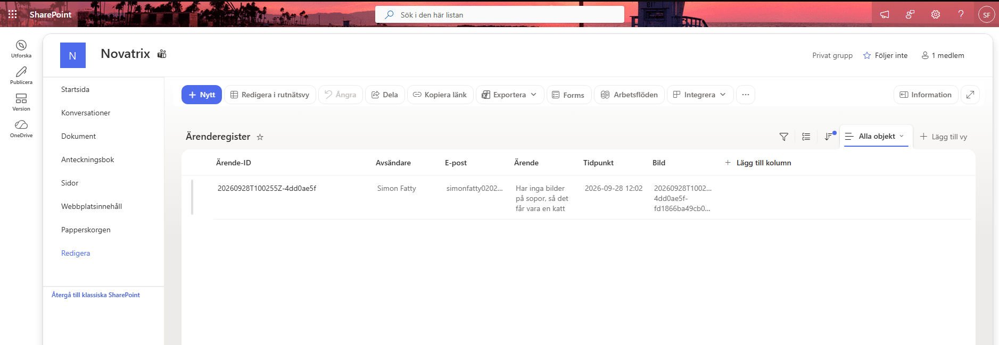
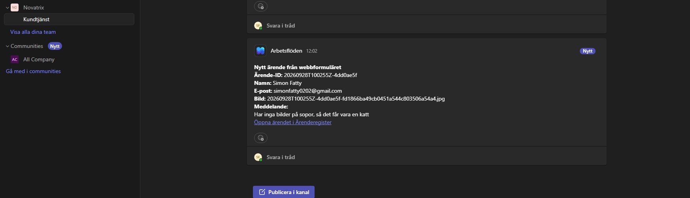

# Azure - Uppgift 6 (V39)
**Automation och integration med Power Automate**

**Namn:** Simon Fatty

**Repo:** https://github.com/02simfat/azure-MOV25

**Datum:** 2026-09-28

---

## Översikt

När en kund skickar in ett ärende i Novatrix webbformulär händer två saker automatiskt i Microsoft 365. Ärendet sparas som en rad i SharePoint-listan **Ärenderegister**, och kundtjänst får en notis i Teams-kanalen **Kundtjänst**. Ingen människa behöver kopiera något.

## Kedjan

```text
Formuläret på webb-VM:en (Azure)
     POST /submit
app.py sparar arende-<id>.json i containern arenden   (hanterad identitet, ingen nyckel)
   ↓  POST med ärendet som JSON till flödets HTTP-adress (FLOW_URL)
Power Automate: "Novatrix Ticket to M365 (HTTP)"
   ↓
1. Rad i SharePoint-listan Ärenderegister
   ↓
2. Notis i Teams › Novatrix › Kundtjänst, med länk till raden
```

## För G

| Krav | Vad jag gjorde | Visas i |
| :--- | :--- | :--- |
| Ett flöde som triggas när ett nytt ärende kommer in | HTTP-trigger som appen anropar direkt när ärendet är sparat | Bild 2 |
| En post i ärenderegistret i SharePoint | Åtgärden `Create ticket in SharePoint list` | Bild 6 |
| En notis till kundtjänst | Åtgärden `Post notice to Teams Kundtjanst` | Bild 7 |
| Kopplat till Azure-lösningen | Appen på VM:en skickar ärendet till flödets URL | Avsnitt 1 |
| Hela kedjan verifierad | Ett ärende från formuläret syns i lagringen, körhistoriken, SharePoint och Teams | Avsnitt 3 |
| Dokumenterat i repot | README, byggskript och flödets export i `flow/` | Filer |

---

## 1. Azure-delen som kod

Hela Azure-delen byggs med ett skript. Inget är klickat i portalen.

```bash
bash build-v39.sh
```

Skriptet skapar resursgrupp, VNet, NSG (port 80 öppen, SSH bara från min egen IP), lagringskonto med containern `arenden` och en Ubuntu-VM med system-tilldelad identitet. VM:en får rollen `Storage Blob Data Contributor` på lagringskontot. Cloud-init installerar nginx och `app.py`.

`cloud-init.txt` är en mall. Skriptet fyller i den i en lokal kopia, `cloud-init.generated.txt`:

| Inställning i app.py | Värde |
| :--- | :--- |
| `STORAGE_ACCOUNT` | `stnovatrixsimon2` |
| `BLOB_LAYOUT` | `root`, så att ärendet sparas som `arende-<id>.json` i containerns rot |
| `FLOW_URL` | Flödets HTTP-adress, läses från `flow-url.txt` (hemlig, se avsnitt 5) |

Hälsokontroll på VM:en:

```bash
ssh azureuser@<vm-ip> "curl -s localhost:5000/health"
```

```json
{"account":"stnovatrixsimon2","blob_layout":"root","container":"arenden","flow_configured":true,"status":"ok"}
```

`"flow_configured": true` visar att appen har fått flödets adress.

---

## 2. Flödet i Power Automate

Flödet heter **Novatrix Ticket to M365 (HTTP)** och har en trigger och två åtgärder som körs i ordning:

| Steg | Typ | Vad det gör |
| :--- | :--- | :--- |
| `manual` | Trigger: När en HTTP-begäran tas emot | Tar emot ärendet som JSON från appen |
| `Create ticket in SharePoint list` | SharePoint: Skapa objekt | Skapar en rad i Ärenderegister |
| `Post notice to Teams Kundtjanst` | Teams: Publicera meddelande i en kanal | Postar en notis i Kundtjänst med länk till raden |

Triggerns JSON-schema har samma fält som appen skickar:

```json
{
  "type": "object",
  "properties": {
    "id":      { "type": "string" },
    "name":    { "type": "string" },
    "mail":    { "type": "string" },
    "message": { "type": "string" },
    "created": { "type": "string" },
    "image":   { "type": "string" }
  }
}
```

Kolumnerna i SharePoint-listan fylls med dynamiskt innehåll från triggern:

| Kolumn | Uttryck |
| :--- | :--- |
| Ärende-ID | `triggerBody()?['id']` |
| Avsändare | `triggerBody()?['name']` |
| E-post | `triggerBody()?['mail']` |
| Ärende | `triggerBody()?['message']` |
| Tidpunkt | `convertFromUtc(utcNow(), 'W. Europe Standard Time', 'yyyy-MM-dd HH:mm')` |
| Bild | `triggerBody()?['image']` |

Teams-notisen använder samma fält och länkar till raden som skapades i steget innan:

```text
outputs('Create_ticket_in_SharePoint_list')?['body/{Link}']
```

Flödets hela definition är exporterad via **Lösningar** och ligger som JSON i `flow/`.

---

## 3. Verifiering av hela kedjan

Jag skickade in ett ärende med en bild via formuläret.

**Bild 1.** Tack-sidan visar ärendets id `20260928T100255Z-4dd0ae5f`.



**Bild 2.** Ärendet och bilden ligger i containerns rot i `stnovatrixsimon2`.



**Bild 3.** Innehållet i `arende-<id>.json`.



**Bild 4.** Den bifogade bilden sparades också.



**Bild 5.** Körhistoriken. Alla tre stegen är gröna.



**Bild 6.** Raden i SharePoint-listan Ärenderegister.



**Bild 7.** Notisen i Teams › Novatrix › Kundtjänst.



Samma ärende-id syns i alla led: formuläret, lagringen, SharePoint och Teams.

---

## 4. Motivering av designen

- **HTTP-trigger i stället för blob-trigger.** Flödet startar direkt. Blob-triggern kollar bara ungefär en gång i minuten. Ärendet kommer som JSON i anropet, så flödet behöver inte läsa bloben och behöver ingen lagringsnyckel.
- **SharePoint först, Teams sedan.** Registret är det som ska finnas kvar. Teams-steget körs bara om raden skapades (`runAfter: Succeeded`) och kan då länka direkt till den.
- **Teams för notisen.** Kundtjänst jobbar redan i Teams, så notisen syns där den behövs.
- **Ärendet sparas i Azure innan flödet anropas.** I `app.py` ligger anropet till flödet i `try/except`. Om flödet är nere finns ärendet ändå kvar i lagringen.

---

## 5. Säkerhet

- Flödets URL innehåller en signatur (`sig=`) och fungerar som ett lösenord. Den ligger i `flow-url.txt`. `.gitignore` stoppar både den och `cloud-init.generated.txt` från att hamna på GitHub.
- VM:en skriver till lagringen med hanterad identitet och en RBAC-roll. Det finns inga nycklar i koden.
- SSH är bara öppet från min egen IP.

---

## Filer

```text
V39/
├── README.md          den här filen
├── build-v39.sh       bygger hela Azure-delen
├── destroy-v39.sh     river resursgruppen
├── cloud-init.txt     mall med platshållare
├── .gitignore         stoppar flow-url.txt och cloud-init.generated.txt
├── flow/              flödets export från Lösningar (JSON)
└── Bilder-v39/        skärmbilder
```

Städning när jag är klar:

```bash
bash destroy-v39.sh
```
