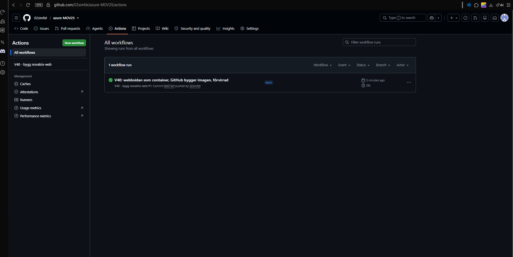
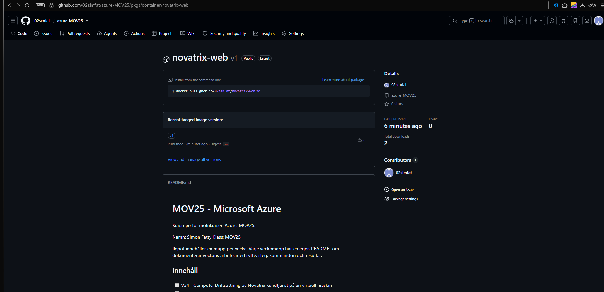
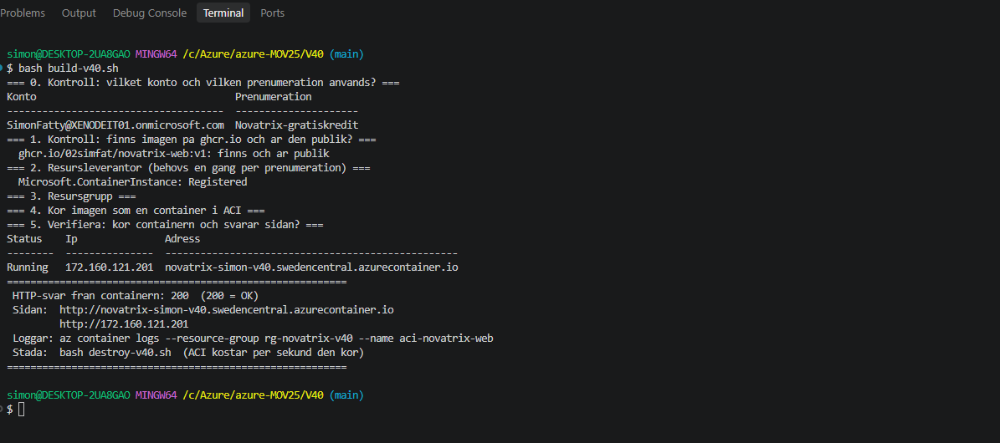
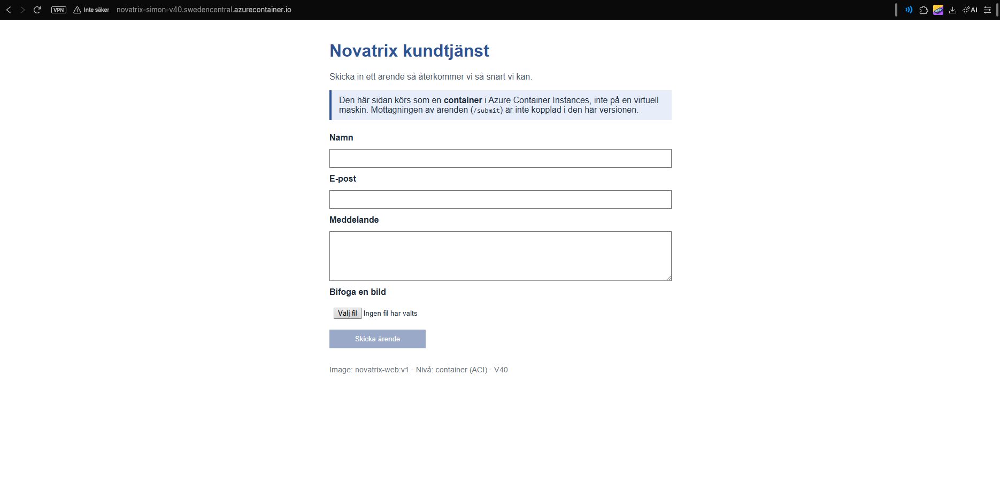
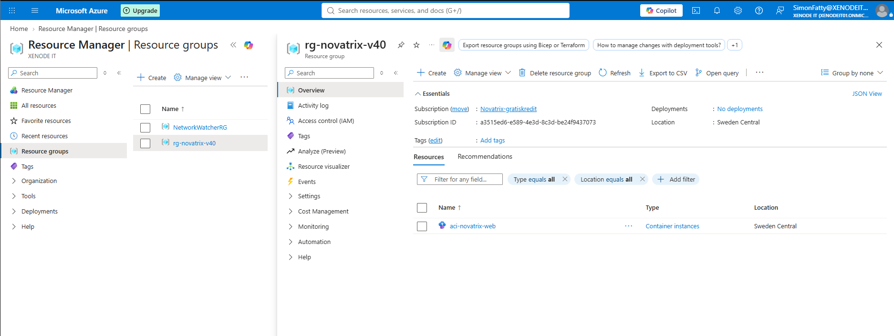
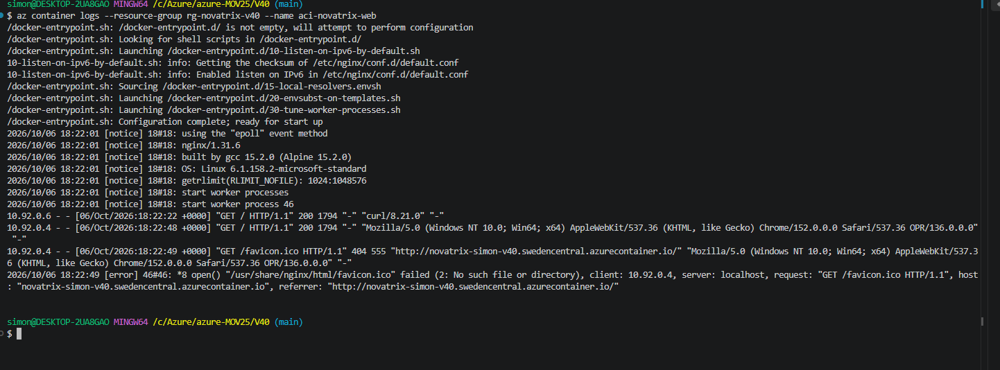

# Azure - Uppgift 7 (V40)
**Virtualiseringsnivåer: VM, containers och serverless**

**Namn:** Simon Fatty

**Repo:** https://github.com/02simfat/azure-MOV25

**Datum:** 2026-10-05

---

## Översikt

Novatrix kundtjänst har hela kursen körts på en virtuell maskin (V34–V39). I V40 kör jag en del av kundtjänsten på en annan nivå: **webbsidan med ärendeformuläret körs som en container** i Azure Container Instances (ACI). Ingen VM är inblandad.

Imagen byggs av **GitHub Actions** från min Dockerfile och lagras i **GitHub Container Registry** (`ghcr.io`). Azure Container Instances hämtar imagen därifrån och kör den. Allt är kod i repot, inget klickas fram i Azure-portalen.

Varför GitHub bygger imagen och inte Azure förklaras i avsnitt 9.

## Kedjan

```text
V40/container/Dockerfile + index.html            receptet, text i repot
   ↓  git push startar GitHub Actions
image novatrix-web:v1                            bygga (på GitHubs server)
   ↓  pushas till
ghcr.io/02simfat/novatrix-web:v1                 lagra (GitHub Container Registry)
   ↓  az container create
container aci-novatrix-web i ACI                 köra (i Azure)
   ↓
http://novatrix-simon-v40.swedencentral.azurecontainer.io   verifiera
```

## För G

| Krav | Vad jag gjorde | Visas i |
| :--- | :--- | :--- |
| Avsnitt för v40 och uppdaterad README | Mappen `V40/` med README, kod och bilder. V40 bockad i huvud-README. | Filer |
| Kört en del av kundtjänsten på en alternativ nivå | Webbsidan med formuläret som container i ACI | Avsnitt 4 och 5 |
| Förklarat VM, containers och serverless | Vad de är och hur de fungerar | Avsnitt 1 och 2 |
| Förklarat skillnaderna | Jämförelsetabell och hur appen paketeras per nivå | Avsnitt 2 |
| För- och nackdelar för ärendemottagningen | En tabell per nivå | Avsnitt 3 |
| Visat att det fungerar | Status `Running`, HTTP 200, sidan i webbläsaren, loggar | Avsnitt 6 |

---

## 1. Vad är virtualisering?

Virtualisering betyder att **en fysisk dator delas upp i flera virtuella miljöer**. Varje miljö tror att den har en egen dator.

- **Värden (host)** är den fysiska servern i Microsofts datacenter.
- **Gästen** är den virtuella miljön som körs ovanpå värden.

Hela Azure bygger på virtualisering. Det är därför jag kan skapa en server på några minuter i stället för att köpa hårdvara.

De tre nivåerna skiljer sig i **hur mycket gästen delar med värden** och **hur mycket molnet sköter åt mig**.

---

## 2. De tre nivåerna

### Nivå 1: Virtuell maskin (VM)

En VM är **en hel dator i molnet** med ett eget operativsystem, till exempel Ubuntu. Den är en tung gäst, eftersom den har ett helt eget OS med egen kärna.

Det är nivån Novatrix har kört på hittills. I V39 installerade cloud-init nginx, Python och `app.py` på VM:en.

På en VM sköter jag själv:

- operativsystemet: uppdateringar och säkerhetshål
- paket och runtime som appen behöver (nginx, Python)
- säkerheten: NSG, SSH-nycklar, behörigheter
- skalning: fler servrar och en lastbalanserare om trafiken ökar

En VM kostar **dygnet runt** så länge den är igång, även när ingen använder sidan.

### Nivå 2: Container

En container **packar appen och allt den behöver** (kod, bibliotek, webbserver) i ett paket. Den har **inget eget OS**. Den lånar värdens kärna. Därför är den lätt och startar på **sekunder**.

Två ord som måste hållas isär:

| Ord | Betyder | Liknelse |
| :--- | :--- | :--- |
| **Image** | Den färdiga, frysta mallen. Ändras inte när den körs. | Receptet |
| **Container** | En körande kopia av imagen. | Den lagade maten |

Receptet skrivs i en **Dockerfile**, som är vanlig text i repot. Från en image kan jag starta många likadana containrar.

Den stora fördelen är **portabilitet**. Samma image kör likadant på min dator, i en testmiljö och i Azure. Det löser problemet "det funkar på min dator men inte på servern".

I Azure finns en tjänst för varje steg:

| Tjänst | Vad den gör |
| :--- | :--- |
| **ACR** (Azure Container Registry) | Privat lager för images |
| **ACI** (Azure Container Instances) | Kör en container snabbt. Betala per sekund. Bra för test. |
| **Container Apps** | För drift: skalar automatiskt, även ner till noll |

I min lösning kör jag containern i **ACI**. Som registry använder jag GitHub Container Registry i stället för ACR (avsnitt 9). Det är samma idé: ett lager för images som körtjänsten hämtar från.

### Nivå 3: Serverless (Azure Functions)

Med serverless skriver jag **bara koden**. Det finns servrar, men jag ser dem aldrig och sköter dem inte.

- Koden körs när en **trigger** händer, till exempel ett HTTP-anrop eller en ny fil i lagringen.
- Molnet startar körmiljön, kör koden och stänger den igen.
- Den **skalar automatiskt**, från noll till många samtidiga körningar.
- Jag **betalar per körning**. Ingen trafik betyder ingen kostnad.
- **Cold start:** om funktionen har vilat tar det första anropet lite längre tid. Sedan går det snabbt.

### Jämförelse

| Nivå | Kontroll | Drift (vad jag sköter) | Kostnad | Skalbarhet | Start | Portabilitet |
| :--- | :--- | :--- | :--- | :--- | :--- | :--- |
| **VM** | Mest. Hela OS:et. | Mest. OS, paket, säkerhet, skalning. | Fast, dygnet runt | Manuell och trög | Minuter | Lägst |
| **Container** | Mitten. Appens miljö via imagen. | Mindre. Bara imagen och appen. | Per körande instans | Snabb, fler kopior av imagen | Sekunder | Högst |
| **Serverless** | Minst. Bara koden. | Minst. Bara koden. | Per körning, noll vid noll trafik | Automatisk | Direkt (utom cold start) | Bunden till Azure |

Mönstret: **ju högre nivå, desto mindre sköter jag själv, men desto mindre kontroll har jag.** Nivåerna är en skala, inte tre lådor. Ingen nivå är bäst för allt.

### Hur samma app paketeras på varje nivå

| Nivå | Så kommer Novatrix webbsida upp |
| :--- | :--- |
| **VM** | cloud-init installerar nginx, skriver `index.html` och startar tjänsterna på en hel Ubuntu-server (V39) |
| **Container** | En Dockerfile på tre rader bakar in `index.html` i en nginx-image. Den byggs en gång och körs var som helst. |
| **Serverless** | Bara funktionskoden laddas upp. Azure sköter resten. |

En liknelse: **VM är ett eget hus** (frihet, men jag sköter allt). **Containern är en lägenhet** (mitt eget hem, men huset och grunden delas). **Serverless är ett hotellrum** (allt sköts, jag betalar per natt).

---

## 3. Ärendemottagningen på de tre nivåerna

Ärendemottagningen är den lilla delen som tar emot formulärets inskick (`POST /submit`) och sparar ärendet som JSON i lagringskontot. Idag är det `app.py` på VM:en.

| Nivå | Fördelar för ärendemottagningen | Nackdelar för ärendemottagningen |
| :--- | :--- | :--- |
| **VM** | Full kontroll. Fungerar redan (V37–V39). Hanterad identitet mot lagringen. | Kostar dygnet runt fast ärenden kommer sällan. Jag måste patcha OS:et. Skalar inte av sig själv vid många ärenden samtidigt. |
| **Container** | Startar snabbt. Samma image i test och drift. Ingen OS-drift. | Står ändå och kör (och kostar) mellan ärendena i ACI. Jag måste bygga om imagen vid ändringar. |
| **Serverless** | Körs bara när ett ärende kommer in. Betala per ärende. Skalar automatiskt om många skickar samtidigt. Ingen server alls. | Cold start kan ge en kort fördröjning för kunden. Minst kontroll. Koden blir bunden till Azure Functions. |

**Slutsats:** ärendemottagningen är ett **kort jobb som körs ojämnt**, bara när någon skickar in ett ärende. Det passar **serverless** bäst. Själva **webbsidan** ska däremot alltid kunna svara när en kund besöker den. Det passar en **container**. En lösning får blanda nivåer: varje del hamnar där den passar bäst.

---

## 4. Mitt val: webbsidan som container i ACI

Jag valde att köra **webbsidan med formuläret som en container**.

- **Sidan ska alltid svara.** Den är inte ett kort jobb, så den passar sämre som en funktion som startar vid varje besök.
- **Mindre drift än VM:en.** Jag sköter inget operativsystem, bara en image på tre rader.
- **Snabb och portabel.** Containern startar på sekunder och samma image kan köras var som helst.
- **ACI för test.** ACI är det enklaste sättet att köra en container. För riktig drift skulle Container Apps passa bättre, eftersom den skalar automatiskt.

Ärendemottagningen ingår inte i containern. Knappen "Skicka ärende" är avstängd och sidan säger det. Enligt avsnitt 3 passar mottagningen bäst som en Azure Function med HTTP-trigger. Det är nästa steg.

---

## 5. Så byggde jag det

### Dockerfile

Receptet ligger i `V40/container/Dockerfile`:

```dockerfile
FROM nginx:alpine
COPY index.html /usr/share/nginx/html/index.html
EXPOSE 80
```

| Rad | Vad den gör |
| :--- | :--- |
| `FROM nginx:alpine` | Basimage: en liten Linux (Alpine) där webbservern nginx redan finns. Liten image = snabbare och mindre att skydda. |
| `COPY index.html ...` | Kopierar in Novatrix sida till mappen där nginx letar efter webbsidor |
| `EXPOSE 80` | Talar om att containern lyssnar på port 80 (HTTP) |

Ingen `CMD` behövs. Basimagen startar redan nginx när containern startar.

### Webbsidan

`V40/container/index.html` är samma formulär som på VM:en. Jag har lagt till en ruta som visar att sidan körs som container, och en rad längst ner med imagens version (`novatrix-web:v1`). Knappen är avstängd eftersom mottagningen inte ingår (avsnitt 4).

### Bygga och lagra: GitHub Actions

Imagen byggs av ett arbetsflöde i GitHub Actions: `.github/workflows/v40-bygg-image.yml` (i repots rot, där GitHub letar efter arbetsflöden). Det startar av sig självt när jag pushar en ändring i `V40/container/`.

```yaml
on:
  push:
    branches: [main]
    paths:
      - "V40/container/**"
      - ".github/workflows/v40-bygg-image.yml"
  workflow_dispatch:

permissions:
  contents: read
  packages: write

jobs:
  bygg-och-pusha:
    runs-on: ubuntu-latest
    steps:
      - uses: actions/checkout@v4
      - uses: docker/login-action@v3
        with:
          registry: ghcr.io
          username: ${{ github.actor }}
          password: ${{ secrets.GITHUB_TOKEN }}
      - uses: docker/build-push-action@v6
        with:
          context: V40/container
          platforms: linux/amd64
          push: true
          provenance: false
          sbom: false
          tags: ghcr.io/02simfat/novatrix-web:v1
```

| Del | Vad den gör |
| :--- | :--- |
| `on: push ... paths` | Kör bara när receptet eller arbetsflödet ändras. `workflow_dispatch` gör att jag också kan starta det för hand. |
| `permissions` | Minsta behörighet: läsa koden och skriva till paketregistret |
| `runs-on: ubuntu-latest` | Bygget körs på en Linux-server hos GitHub, där Docker redan finns |
| `actions/checkout` | Hämtar koden från repot |
| `docker/login-action` | Loggar in i `ghcr.io` med `GITHUB_TOKEN`, en tillfällig nyckel som GitHub skapar för varje körning |
| `docker/build-push-action` | Kör `docker build` på mappen `V40/container` och pushar imagen |
| `platforms: linux/amd64` | Den sortens Linux-image som ACI kör |
| `provenance: false`, `sbom: false` | Pushar en enkel image utan extra bilagor, så att ACI läser den utan problem |
| `tags: ...:v1` | Imagens namn och version. Inte `latest`, så jag vet vilken version som körs. |

Efter första bygget gjorde jag paketet **novatrix-web** publikt på GitHub (Package settings → Change visibility → Public). Då kan ACI hämta imagen utan lösenord.

### Köra: byggskriptet

Containern startas med ett skript från mappen `V40` i Git Bash:

```bash
bash build-v40.sh
```

| Steg | Vad skriptet gör | Varför |
| :--- | :--- | :--- |
| 0 | Visar konto och prenumeration | Kolla att jag är i rätt prenumeration |
| 1 | Kollar att imagen finns på `ghcr.io` och är publik | Stannar med ett tydligt fel innan något skapas i Azure |
| 2 | Registrerar `Microsoft.ContainerInstance` | Annars svarar Azure "subscription is not registered" |
| 3 | Skapar resursgruppen `rg-novatrix-v40` | En egen grupp för veckan, lätt att riva |
| 4 | `az container create` startar containern med port 80 och ett DNS-namn | Kör imagen och ger sidan en publik adress |
| 5 | Visar status och testar sidan med `curl` | Verifiera, gissa aldrig |

Det viktigaste kommandot:

```bash
az container create --resource-group rg-novatrix-v40 --name aci-novatrix-web \
  --image ghcr.io/02simfat/novatrix-web:v1 \
  --os-type Linux --cpu 1 --memory 1 \
  --ports 80 --ip-address Public --dns-name-label novatrix-simon-v40
```

| Del | Vad den gör |
| :--- | :--- |
| `--image ghcr.io/...:v1` | Vilken image som ska köras |
| `--os-type Linux --cpu 1 --memory 1` | Linux-container med 1 CPU och 1 GB minne |
| `--ports 80 --ip-address Public` | Öppnar port 80 mot internet |
| `--dns-name-label novatrix-simon-v40` | Ger ett läsbart namn: `novatrix-simon-v40.swedencentral.azurecontainer.io` |

---

## 6. Verifiering

Jag verifierar från flera håll: att bygget lyckades, att imagen finns, att containern kör, att sidan svarar och vad loggarna säger.

**Containern kör:**

```bash
az container show --resource-group rg-novatrix-v40 --name aci-novatrix-web \
  --query "{status:instanceView.state, ip:ipAddress.ip, adress:ipAddress.fqdn}" -o table
```

**Sidan svarar med 200 OK från nginx:**

```bash
curl -I http://novatrix-simon-v40.swedencentral.azurecontainer.io
```

**Loggarna visar besöket:**

```bash
az container logs --resource-group rg-novatrix-v40 --name aci-novatrix-web
```

**Bild 1.** Körningen i GitHub Actions är grön. Imagen är byggd och pushad.



**Bild 2.** Paketet `novatrix-web` med taggen `v1` på GitHub. Det är publikt.



**Bild 3.** Slutet av byggskriptet: status `Running` och HTTP-svar `200`.



**Bild 4.** Novatrix sida i webbläsaren på containerns adress.



**Bild 5.** Resursgruppen `rg-novatrix-v40` i portalen. Där finns en container instance, men ingen virtuell maskin.



**Bild 6.** Containerns loggar. nginx har svarat `200` på `GET /`.



---

## 7. Säkerhet

- **Inga lösenord någonstans.** GitHub Actions loggar in med `GITHUB_TOKEN`, en tillfällig nyckel som GitHub skapar för varje körning. ACI hämtar en publik image och behöver ingen inloggning.
- **Imagen är publik, och det är okej här.** Den innehåller bara en webbsida som ändå är publik. Regeln jag följer: lägg aldrig hemligheter, nycklar eller lösenord i en image.
- **Om imagen hade innehållit något hemligt** skulle jag ha ett privat registry, till exempel ACR, och ge containern en **hanterad identitet** med rollen `AcrPull`, precis som VM:en fick en identitet mot lagringen i V37.
- **Minsta behörighet i arbetsflödet.** Det får bara läsa koden och skriva paket.
- **Bara port 80 är öppen.** Containern har inget SSH och inget annat öppet.
- **Liten image.** Alpine innehåller bara det som behövs, så det finns mindre att angripa.

---

## 8. Kostnad och städning

| Resurs | Hur den kostar |
| :--- | :--- |
| Container i ACI | Per sekund den kör |
| Imagen på ghcr.io | Gratis för publika paket |
| GitHub Actions | Gratis för publika repon |

När jag har verifierat och tagit bilderna river jag allt i Azure:

```bash
bash destroy-v40.sh
```

Skriptet kör `az group delete` på `rg-novatrix-v40`. Imagen ligger kvar på GitHub, så `build-v40.sh` kan starta containern igen på någon minut.

---

## 9. Problem jag stötte på och felsökning

### Problem 1: `az acr build` var avstängt

Först byggde skriptet imagen i Azure med `az acr build`, som Andreas gjorde i demon. Det stoppades med det här felet:

```text
(TasksOperationsNotAllowed) ACR Tasks requests for the registry acrnovatrixsimon and <prenumerations-id> are not permitted.
```

Så här läste jag felet:

- **`TasksOperationsNotAllowed`:** `az acr build` körs av en tjänst som heter **ACR Tasks**. Den tjänsten fick inte köras.
- **`for the registry ... and <prenumerations-id>`:** stoppet gäller min prenumeration, inte mitt skript.
- **Orsak:** min prenumeration (`Novatrix-gratiskredit`) använder Azures gratiskredit. Microsoft har stängt av ACR Tasks för prenumerationer som betalas med gratiskredit.

### Problem 2: ingen Docker på datorn

Nästa idé var att bygga med `docker build` på min dator. Men Docker är inte installerat (`bash: docker: command not found`).

### Lösningen: GitHub bygger imagen

GitHub Actions har Docker på sina servrar. Arbetsflödet bygger **samma Dockerfile** och lagrar imagen i GitHub Container Registry. Det enda som har ändrats är **var** bygget körs och **var** imagen lagras. Containern körs fortfarande i Azure Container Instances. Andreas nämnde den här vägen på genomgången: att låta GitHub bygga imagen.

En bonus: lösningen behöver inga lösenord alls (avsnitt 7).

### Andra fel som kan dyka upp

| Felmeddelande | Orsak | Lösning |
| :--- | :--- | :--- |
| `Hittar inte ghcr.io/02simfat/novatrix-web:v1 (svar: 403)` | Bygget har inte körts, eller paketet är inte publikt | Kolla att Actions-körningen är grön och att paketet är Public |
| Actions-körningen blir röd | Fel i Dockerfile eller i arbetsflödet | Öppna körningen och läs det röda steget |
| `subscription is not registered to use namespace Microsoft.ContainerInstance` | Resursleverantören är inte registrerad | Steg 2 i skriptet gör det och väntar tills den är `Registered` |
| Krav på OS-typ | Nyare Azure CLI kräver det | `--os-type Linux --cpu 1 --memory 1` |
| DNS-namnet är upptaget | Namnet måste vara unikt i regionen | Byt `DNS_LABEL` högst upp i skriptet |

---

## Filer

```text
azure-MOV25/
├── .github/workflows/
│   └── v40-bygg-image.yml   GitHub Actions: bygger imagen och pushar till ghcr.io
└── V40/
    ├── README.md            den här filen
    ├── build-v40.sh         startar containern i ACI och verifierar
    ├── destroy-v40.sh       river resursgruppen
    ├── container/
    │   ├── Dockerfile       receptet för imagen
    │   └── index.html       Novatrix sida i containerversion
    └── Bilder-v40/          skärmbilder
```
